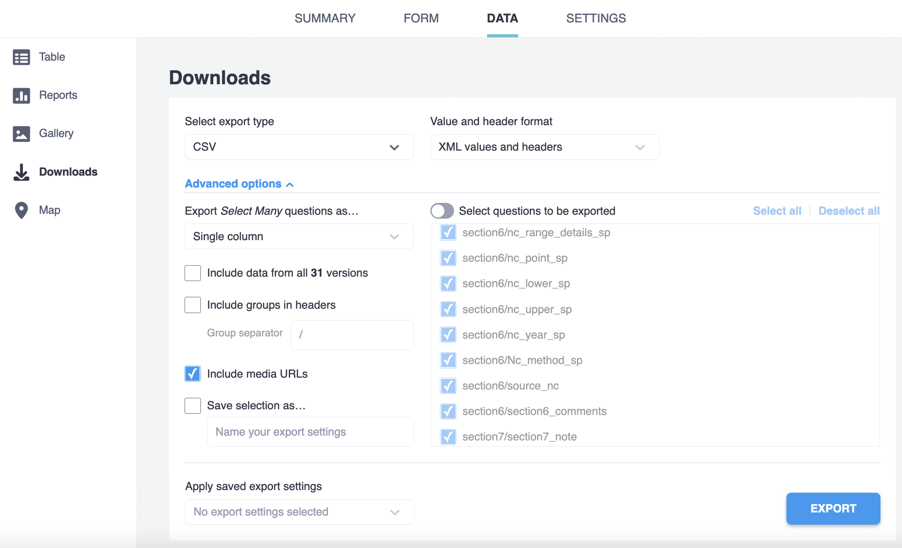

# Resources for the Multinational evaluation of genetic diversity indicators for the Kunming-Montreal Global Biodiversity Monitoring framework

In 2020, three genetic diversity indicators were proposed and discussed[1-4]:

* **Ne 500 indicator:** the proportion of populations within species with an effective population size (Ne) greater than 500. 

* **PM indicator:** the proportion of maintained populations within species.

* **genetic monitoring  indicator:** number of species in which genetic diversity has been or is being monitored using DNA-based methods

In December 2022, the United Nations Convention of Biological Diversity (CBD) Kunming-Montreal Global Biodiversity Framework (GBF) was adopted by the 196 Parties. The Ne 500 and PM indicators were adopted in the GBF (Annex 1 of CBD/COP/DEC/15/5), which means that parties will be using these indicators to report on their progress over the next decade. 

To facilitate and standardize data collection across different groups and countries, we have created: 

**1)** Guidance documents to prepare the project and answer the form. 

**2)** An online data collection form using [Kobotoolbox](https://www.kobotoolbox.org/),  

**3)** Processing scripts to estimate the indicators based on the Kobo form output. 

**4)** A first multinational evaluation of genetic diversity indicators using the former guidelines, collection tool and informatics pipeline.

In this repository you can find the files, documentation and relevant links of each of the points mentioned above.

#### How to cite

If you use any of the materials listed below, please cite: 

* Hoban, S., da Silva, J. M., Mastretta-Yanes, A., Grueber, C. E., Heuertz, M., Hunter, M. E., Mergeay, J., Paz-Vinas, I., Fukaya, K., Ishihama, F., Jordan, R., Köppä, V., Latorre-Cárdenas, M. C., MacDonald, A. J., Rincon-Parra, V., Sjögren-Gulve, P., Tani, N., Thurfjell, H., & Laikre, L. (2023). **Monitoring status and trends in genetic diversity for the Convention on Biological Diversity: An ongoing assessment of genetic indicators in nine countries**. *Conservation Letters*, 16(3), e12953. [https://doi.org/10.1111/conl.12953](https://doi.org/10.1111/conl.12953)

* Mastretta-Yanes\*, A., da Silva\*, J., Grueber, C. E., ... Laikre, L. & Hoban, S. (2023). **Multinational evaluation of genetic diversity indicators for the Kunming-Montreal Global Biodiversity Monitoring framework**. *EcoEvoRxiv* (Pre-Print). https://ecoevorxiv.org/repository/view/6104/. DOI: [https://doi.org/10.32942/X2WK6T](https://doi.org/10.32942/X2WK6T)


#### Get in touch and more help

If you have a question that is not answered in the guidance documents available below, please post it on the [Genetic Indicators Google Group](https://groups.google.com/g/genetic-indicators-project), and a member will try to answer you as soon as posible.


### 1. Guidance documents:

The following guides were used to provide detailed advice on how to undertake  the genetic monitoring at the country level for a set of species, as well as how to answer each question of the Kobo form.

* **Overall Project Guidance document**  [available as pdf here](./Indicator_testing_project_proposed_detailed_guidance.pdfg). This document includes detailed definitions on key terms (e.g. what is a population), as well as information on how to select a species list and what types of data sources could be used.

* **Genetic Diversity Indicator Testing Kobo Manual**
 [available as pdf as pdf here](./Genetic Diversity Indicator Testing Kobo v4.0 Manual.pdf). This manual provides detailed advice on how to answer each question, with examples if necessary. 


### 2. Online data collection form using Kobotoolbox

Kobotoolbox is a free and open source tool for data collection. It allows to easily develop digital data collection forms that work on both mobile devices and web browsers. Data can be collected from different devices and people, and is accessible through the KoboToolbox interface. This data can then be downloaded into multiple formats for use in applications such as Excel, R, Phyton or GIS software.

#### 2.1 Koboform: 

We built a Kobo form for collecting the needed raw data to estimate de Genetic Diversity Indicators mentioned above, as well as species taxonomic information and assessor's and country information. 

You can see a **dummy example** of how the online form looks once it is deployed in Kobo here: [https://ee.kobotoolbox.org/preview/2KDHEWrb](https://ee.kobotoolbox.org/preview/2KDHEWrb). **Notice that this form is just an example and it can NOT be used to collect real data.** 

If you want to use this form to collect data for your country or desired species, you can contact Alicia Mastretta-Yanes (amastretta@conabio.gob.mx) to get access to the data-collection form where other teams are collecting data. Alternatively **you can deploy your own version of the form** in Kobotoolbox as follows:

1. Download the file [kobo_form.xlsx](https://github.com/AliciaMstt/GeneticIndicators/raw/main/kobo_form.xlsx) from this repository, which is the .xlsx version of the Kobo form.
2. Import it to Kobotoolbox following [these instructions](https://support.kobotoolbox.org/new_form.html).

Check [Kobotoolbox documentation](https://support.kobotoolbox.org/welcome.html) for further details on how to deploy and use it. You can also use our scripts (see below) to process the output in order to estimate the indicators.


#### 2.2. Population information template:

If information of more than 25 populations will be used to collect data for indicator 2 (Section 5 of the Kobo form) it is possible to use the following template to upload data instead of using the kobo form. **This is only encouraged in cases when data is extracted programatically from extant databases,** otherwise we **strongly recommend** using the Kobo form to avoid mistakes. The form allows to manually fill the information of up to 25 populations, but you can add as many populations as needed in a text file following this template.

**Template text version:** [populations\_data_template.txt](populations_data_template.txt). Notice that the first lines starting with `#` are comments to guide you in how the data of each variable (column) should be formatted. You can keep or delete these lines in your data file, but if you keep them do not delete the `#` at te beginning of each line.

**Template Excel version:** [populations\_data_template.xlsx](populations_data_template.xlsx). This is an Excel spreadsheet that contains validation for text variables where controlled vocabularies are available. The tab “Input” is where the data should be entered. Cells that are YELLOW contain validation. For multiple rows, please copy the first data entry row (row 2) so that the validation is applied. The tab “Validation” are the validation options. Do not change these options. The tab “Guide” is a copy of the formating instructions available at [populations\_data_template.txt](populations_data_template.txt).

Regardless of which template you used, save your data as .txt tab delimited file in UTF-8 encoding.

#### 2.3. Downloading kobo data

Once the form has been answered in kobo, you can download the data in .csv or .xlsx or other formats to analyse it in R, Excel or other software.

You can either analyse the data directly, or first run a quality check. 

The R processing scripts and functions described below assume that the data was downloaded from Kobotoolbox using the following settings:



The variables names in the exported data match the "name" column in the   [kobo_form.xlsx](https://github.com/AliciaMstt/GeneticIndicators/raw/main/kobo_form.xlsx) survey tab. In the same file, you can check the question of the form it refers too in the "label" tab. 

### 3. Scripts to process the kobo output and estimate the indicators:


#### 3.1. Functions to extract the data for each indicator from the kobo output:

The following R functions take as input a data frame with the data downloaded from the Kobo form "International Genetic Indicator testing" and **extract and format the data** in order to estimate each of the Genetic Diversity Indicators. 


Functions:
 
* [`get_indicator1_data()`](get_indicator1_data.R): extracts and formats the  data needed to estimate the Ne 500 indicator (the proportion of populations within species with an effective population size Ne greater than 500) . **In the kobo output, population data is in different columns, this function transforms it so that population data is in rows.** This is needed for downstream analyses. Notice that if the [Population information template](https://github.com/AliciaMstt/GeneticIndicators#population-information-template) was used (species with more than 25 populations) you will need to run an additional step before analysing the data, see below (Getting the population data if the template was used). In the output, each population is a row, and there are as many rows per taxon as there are populations within it.

* [`get_indicator2_data()`](get_indicator2_data.R): outputs a data frame with the data needed to estimate the PM indicator (the proportion of maintaiened populations within species). Each row is a taxon.

* [`get_indicator3_data()`](get_indicator3_data.R): outputs a data frame with the data needed to estimate the genetic monitoring indicator (number of species in which genetic diversity has been or is being monitored using DNA-based methods). Each row is a taxon.

* [`get_metadata()`](get_metadata.R): extracts the metadata for taxa and indicators, in some cases creating new useful variables, like taxon name (joining Genus, species, etc) and if the taxon was assessed only a single time or multiple times. Each row is a taxon.

Arguments:

`kobo_output` = a data frame object read into R from the `.csv` file 
resulting from exporting the Kobotoolbox data as explained above.

See examples of the output data frames in the "Estimating indicator" sections below. And see the notebook of the notebook on [quality check](https://aliciamstt.github.io/GeneticIndicators/1_quality_check.html) and [cleaning for the multinational assessment](https://aliciamstt.github.io/GeneticIndicators/2_cleaning.html), and [section 4](https://aliciamstt.github.io/GeneticIndicators/#4-pipeline-used-in-the-multinational-assessment) of this README for detailed examples of how these functions were used as part of a pipeline.


### 3.2. Getting the population data if the template was used

If information of more than 25 populations was available for the Ne >500 indicator, it was collected in the [template to upload data instead of using the kobo form](https://github.com/AliciaMstt/GeneticIndicators#population-information-template). In that case, the data gets stored a separate attachment per each taxa, which you need to download and merge with the rest of the data.

The url to the attachment file is available in the kobo output data under the variable `pop_tabular_file_URL`. This url could be used to download each of the attachments with the function: 

* [`download\_kobo\_attachment()`](download_kobo_attachment.R): downloads an attachment of a kobo survey.

 Arguments:
 
 `url` = url to the file to download. For example for pop data downloaded using the template, the url is stored in the column pop_tabular_file_URL of kobo_clean
 
 `local_file_path`  = local path (and file name, including extension) where to save file
 
 `username` = your kobo username, should have permissions to download this data
 
 `password` = your kobo password

Then, the function: 

* [process\_attached\_files()](process_attached_files.R) processes the original attachment files to make them compatible with how population data is expected to estimate the Ne >500 indicator. 

Importantly, it checks the columns that **should be numbers**, but they may have been stored as characters because "," "-" "(" or other characters may have been typed. The function will try to correct this, which **may change the original data**. Please manually check any file flagged as transformed in the log produced by the function to ensure everything is correct.

The output from `process\_attached\_files()` is a data frame that can be joined to the data frame output from `get_indicator1_data()` to estimate the indicator values.

### 3.3. Estimate the Ne 500 indicator

To estimate the Ne 500 indicator you need the data in the format provided by `get_indicator1_data()`, i.e. **each population is a row** and the population size data (either **Ne** or **Nc**) is provided in different columns. Example selecting the most relevant columns:

|taxon          |population |Name            |    Ne| NeLower| NeUpper|NeYear |GeneticMarkers             |NcType   |NcMethod        |NcRange          |
|:--------------|:----------|:---------------|-----:|-------:|-------:|:------|:--------------------------|:--------|:---------------|:----------------|
|Alces alces    |pop1       |North           |  4950|      NA|      NA|2020   |whole\_genome\_sequence\_data |Nc\_range |Nc\_method\_count |more\_5000\_bymuch |
|Alces alces    |pop2       |South           |   194|      NA|      NA|1980   |whole\_genome\_sequence\_data |Nc\_range |Nc\_method\_count |more\_5000\_bymuch |
|Alces alces    |pop3       |Transition zone | 11519|      NA|      NA|2020   |whole\_genome\_sequence\_data |Nc\_range |Nc\_method\_count |more\_5000\_bymuch |
|Siluris glanis |pop1       |Båven           |    12|       6|      33|2004   |microsatellites            |Nc\_range |Nc\_method\_count |less\_5000\_bymuch |
|Siluris glanis |pop2       |lower Emån      |    13|       7|      31|2004   |microsatellites            |Nc\_range |Nc\_method\_count |less\_5000\_bymuch |
|Siluris glanis |pop3       |Upper Emån      |    11|       5|      26|2010   |microsatellites            |Nc\_range |Nc\_method\_count |less\_5000\_bymuch |
|Siluris glanis |pop4       |Möckeln         |    13|       7|      30|2010   |microsatellites            |Nc\_range |Nc\_method\_count |less\_5000\_bymuch |
|Siluris glanis |pop5       |Försjön         |     9|       4|      26|2006   |microsatellites            |Nc\_range |Nc\_method\_count |less\_5000\_bymuch |
|Siluris glanis |pop6       |Helgeå          |    11|       6|      26|2010   |microsatellites            |Nc\_range |Nc\_method\_count |less\_5000\_bymuch |

If **Nc** was provided, it is necessary to **transform it to Ne** by multiplying it for a ratio. This is done with the function:

 
 * [`transform_to_Ne()`](transform_to_Ne.R): This functions gets the Nc data from point or range estimates and transforms it to Ne 
 multiplying for a ratio Ne:Nc (defaults to 0.1 if none provided)
 
 Arguments: 
 `ind1_data`: data for Ne 500 indicator as produced by `get_indicator1_data()`
 `ratio`: desired Ne:Nc ratio. Should range 0-1. Defaults to 0.1
  
 Output:
 Original ind1\_data df with two more columns:
 `Nc\_from\_range`: (conversion of "more than..." to numbers)
 `Ne\_from\_Nc`: Ne estimated from NcRange or NcPoint  
 `Ne\_combined`: Ne estimated from Ne if Ne is available, otherwise, from Nc

Example: `ind1_data<-transform_to_Ne(ind1_data = ind1_data, ratio = 0.1)` 

Output selecting the most relevant columns:

|taxon          |population |Name            |    Ne| NeLower| NeUpper|NeYear |GeneticMarkers             |NcType   |NcMethod        |NcRange          | Nc\_from\_range| Ne\_from\_Nc| Ne\_combined|
|:--------------|:----------|:---------------|-----:|-------:|-------:|:------|:--------------------------|:--------|:---------------|:----------------|-------------:|----------:|-----------:|
|Alces alces    |pop1       |North           |  4950|      NA|      NA|2020   |whole\_genome\_sequence\_data |Nc\_range |Nc\_method\_count |more\_5000\_bymuch |         10000|       1000|        4950|
|Alces alces    |pop2       |South           |   194|      NA|      NA|1980   |whole\_genome\_sequence\_data |Nc\_range |Nc\_method\_count |more\_5000\_bymuch |         10000|       1000|         194|
|Alces alces    |pop3       |Transition zone | 11519|      NA|      NA|2020   |whole\_genome\_sequence\_data |Nc\_range |Nc\_method\_count |more\_5000\_bymuch |         10000|       1000|       11519|
|Siluris glanis |pop1       |Båven           |    12|       6|      33|2004   |microsatellites            |Nc\_range |Nc\_method\_count |less\_5000\_bymuch |           500|         50|          12|
|Siluris glanis |pop2       |lower Emån      |    13|       7|      31|2004   |microsatellites            |Nc\_range |Nc\_method\_count |less\_5000\_bymuch |           500|         50|          13|
|Siluris glanis |pop3       |Upper Emån      |    11|       5|      26|2010   |microsatellites            |Nc\_range |Nc\_method\_count |less\_5000\_bymuch |           500|         50|          11|
|Siluris glanis |pop4       |Möckeln         |    13|       7|      30|2010   |microsatellites            |Nc\_range |Nc\_method\_count |less\_5000\_bymuch |           500|         50|          13|
|Siluris glanis |pop5       |Försjön         |     9|       4|      26|2006   |microsatellites            |Nc\_range |Nc\_method\_count |less\_5000\_bymuch |           500|         50|           9|
|Siluris glanis |pop6       |Helgeå          |    11|       6|      26|2010   |microsatellites            |Nc\_range |Nc\_method\_count |less\_5000\_bymuch |           500|         50|          11|

Lastly, you can estimate the Ne 500 indicator with the funciton:

* [`estimate_indicator1()`](estimate_indicator1.R): This functions estimates the Ne 500 indicator, ie for each assessment of a taxon it calculates the proportion of populations within it which are above Ne 500. Notice it uses the assessment id `X_uuid` (unique record of a taxon), because a single taxon could be assessed by different countries or more than once with different parameters. The output is a new dataframe with a row per assessment, metadata, new columns used to estimate the indicator (number of pops) and the indicator value.
 
Arguments: 
`ind1_data`: population size data as produced by `get_indicator1_data()` and after running `transform_to_Ne()`.

Example: `indicator1<-estimate_indicator1(ind1_data = ind1_data)`

Output selecting the most relevant columns:

|X\_uuid                               |taxon                   |country\_assessment | n\_pops| n\_pops\_Ne\_data| n\_pops\_more\_500| indicator1|
|:------------------------------------|:-----------------------|:------------------|------:|--------------:|---------------:|----------:|
|010d85cd-51d6-4c20-86ee-ebdb21bef77b |Etheostoma chienense    |US                 |      2|              1|               1|          1|
|018d6a54-b069-4bdb-845c-85249bdf2bbb |Graptopetalum bartramii |US                 |     47|             46|               0|          0|
|019bd95f-b8e9-4ef5-9041-ea4e40d81e64 |Cerambyx cerdo          |Sweden             |      1|              1|               0|          0|
|01b10b29-9e13-472b-9bf3-585e990c6905 |Spheniscus demersus     |South Africa       |      1|              1|               1|          1|
|0301e6b3-b4e3-4fdc-9029-d5a375e32f1b |Posidonia oceanica      |France             |      3|              3|               3|          1|
|037d6c8f-7b29-4654-98da-18e31b23c1e0 |Etheostoma maydeni      |US                 |      4|              2|               2|          1|
|03f03179-14bb-4c15-a4fd-5c660b0647c1 |Parahyaena brunnea      |South Africa       |      1|              1|               1|          1|
|0586b61e-7805-42d7-84e1-dd8a6983c941 |Bombina variegata       |Belgium            |     12|             12|               0|          0|
|065a53ba-051b-440c-a189-9a3c47d02571 |Caracal caracal         |South Africa       |      1|              1|               0|          0|
   

See the notebook of the [analyses and figures for the multinational assessment](https://aliciamstt.github.io/GeneticIndicators/3_manuscript_figures_analyses.html#estimate-indicators) and [section 4](https://aliciamstt.github.io/GeneticIndicators/#4-pipeline-used-in-the-multinational-assessment) of this README for detailed examples of how these functions were used as part of a pipeline.


### 3.4. Estimate the PM indicator

To estimate the PM indicator you need the data in the format provided by `get_indicator2_data()`, i.e. **each row is a taxon** of a single assessment, and the number of extant and extinct populations are provided. Example selecting the most relevant columns:


|country\_assessment |taxon                    | n\_extant\_populations| n\_extint\_populations|
|:------------------|:------------------------|--------------------:|--------------------:|
|Sweden             |Alces alces              |                    3|                    0|
|Sweden             |Siluris glanis           |                    6|                    6|
|Sweden             |Dendrocopos leucotos     |                    5|                   12|
|South Africa       |Encephalartos latrifrons |                    1|                    0|
|South Africa       |Capensibufo rosei        |                    2|                    4|
|France             |Galemys pyrenaicus       |                    3|                    0|
|France             |Luscinia svecica         |                    2|                   NA|
|France             |Taxus baccata            |                    1|                   NA|
|France             |Angelica heterocarpa     |                    4|                   NA|


To estimate the PM indicator (proportion of populations maintained within species) you only need to divide the number of currently existing populations (`n_extant_populations`) over the total number of populations, which sums the number of extant and extinct populations (`n_extint_populations`). Notice that the PM indicator can only be estimated if there is no missing data in the number of populations.

Example:

```
ind2_data$indicator2<- ind2_data$n_extant_populations / (ind2_data$n_extant_populations + ind2_data$n_extint_populations)
```

Output selecting the most relevant columns:

|country\_assessment |taxon                    | n\_extant\_populations| n\_extint\_populations| indicator2|
|:------------------|:------------------------|--------------------:|--------------------:|----------:|
|Sweden             |Alces alces              |                    3|                    0|       1.00|
|Sweden             |Siluris glanis           |                    6|                    6|       0.50|
|Sweden             |Dendrocopos leucotos     |                    5|                   12|       0.29|
|South Africa       |Encephalartos latrifrons |                    1|                    0|       1.00|
|South Africa       |Capensibufo rosei        |                    2|                    4|       0.33|
|France             |Galemys pyrenaicus       |                    3|                    0|       1.00|
|France             |Luscinia svecica         |                    2|                   NA|         NA|
|France             |Taxus baccata            |                    1|                   NA|         NA|
|France             |Angelica heterocarpa     |                    4|                   NA|         NA|

See the notebook of the [analyses and figures for the multinational assessment](https://aliciamstt.github.io/GeneticIndicators/3_manuscript_figures_analyses.html#estimate-indicators) and [section 4](https://aliciamstt.github.io/GeneticIndicators/#4-pipeline-used-in-the-multinational-assessment) of this README for detailed examples of how these functions were used as part of a pipeline.

### 3.5. Estimate the genetic monitoring indicator 

The genetic monitoring indicator refers to the number (count) of taxa by country in which genetic monitoring is occurring. This is stored in the variable `temp_gen_monitoring` as a “yes/no” answer for each taxon.

To estimate the genetic monitoring indicator you need the data in the format provided by `get_indicator3_data()`, i.e. **each row is a taxon** and the column `temp_gen_monitoring` is provided along with other variables that provide metadata.

Example selecting the most relevant variables:

|country\_assessment |taxon                    |multiassessment   |temp\_gen\_monitoring |gen\_studies |gen\_monitoring\_years |
|:------------------|:------------------------|:-----------------|:-------------------|:-----------|:--------------------|
|sweden             |Alces alces              |single\_assessment |yes                 |pop         |1839-2020            |
|sweden             |Siluris glanis           |single\_assessment |yes                 |phylo\_pop   |1980-2018            |
|sweden             |Dendrocopos leucotos     |single\_assessment |no                  |phylo\_pop   |NA                   |
|south\_africa       |Encephalartos latrifrons |single\_assessment |no                  |pop         |NA                   |
|south\_africa       |Capensibufo rosei        |single\_assessment |yes                 |phylo\_pop   |2008;2015            |
|france             |Galemys pyrenaicus       |single\_assessment |yes                 |phylo\_pop   |2011-2013            |
|france             |Luscinia svecica         |single\_assessment |no                  |phylo\_pop   |NA                   |
|france             |Taxus baccata            |single\_assessment |no                  |phylo\_pop   |NA                   |
|france             |Angelica heterocarpa     |single\_assessment |no                  |pop         |NA                   |

To estimate the indicator, we only need to count how many "yes" are in `temp_gen_monitoring`, keeping only one of the records if the taxon was multiassessed. For example with `dplyr`:

```
ind3_data %>%
                 # keep only one record if the taxon was assessed more than once within the country
                 select(country_assessment, taxon, temp_gen_monitoring) %>%
                 filter(!duplicated(.)) %>%

                 # count "yes" in tem_gen_monitoring by country
                 filter(temp_gen_monitoring=="yes") %>%
                 group_by(country_assessment) %>%
                 summarise(n_taxon_gen_monitoring= n()) 
```

The output is the number of taxa with genetic monitoring per country (or per any other variable used in `group_by`):

|country\_assessment | n\_taxon\_gen\_monitoring|
|:------------------|----------------------:|
|australia          |                     10|
|belgium            |                     10|
|france             |                      7|
|mexico             |                      7|
|south\_africa       |                      5|
|sweden             |                     20|
|united\_states      |                      6|


See the notebook of the [analyses and figures for the multinational assessment](https://aliciamstt.github.io/GeneticIndicators/3_manuscript_figures_analyses.html#estimate-indicators) and [section 4](https://aliciamstt.github.io/GeneticIndicators/#4-pipeline-used-in-the-multinational-assessment) of this README for detailed examples of how these functions were used as part of a pipeline.

### 3.6. Dependencies

Functions were developed and tested using:

* R version 4.2.1 
* utile.tools_0.2.7 
* dplyr_1.0.9 
* tidyr_1.2.0   


## 4. Pipeline used in the multinational assessment 
In the multinational evaluation of genetic diversity indicators (Mastretta-Yanes, da Silva et al. 2023) the raw kobo output form the form "International Genetic Indicator testing" was downloaded from R as described in section [2.3. Downloading kobo data](https://aliciamstt.github.io/GeneticIndicators/#23-downloading-kobo-data). 

Then, the functions described above were used as part of a pipeline with the following R Markdown notebooks:

* [1\_quality_check](https://aliciamstt.github.io/GeneticIndicators/1_quality_check.html): looks for common sources of error and flags those records manual revision by the assessors who capture data from each country. The output is a file showing the records that need manual review or corrections, if any. Raw [.Rmd file here](./1_quality_check.Rmd).

* [2\_cleaning](https://aliciamstt.github.io/GeneticIndicators/2_cleaning.html): corrects the errors detected by `1_quality_check.Rmd, based on the feed back from the people who collected the data. Corrections are done within this script to ensure reproducibility. The output is a clean kobo file that can be used for analyses. [.Rmd file here](./2_cleaning.Rmd).


* [3\_manuscript\_figures\_analyses](https://aliciamstt.github.io/GeneticIndicators/3_manuscript_figures_analyses.html): This notebook estimates the indicators based on the raw clean data and perfomrs the main analyses and figures used in the manuscript of the multicountry paper. The input is the "clean kobo output" that was first cleaned by `2_cleaning.Rmd`. Besides the plots and statistics , the output is are the indicators data ready to be used to estimate the indicators (`ind[1-3]_data.csv`), a single file with the indicators already calculated (`indicators_full.csv`) and metadata.[.Rmd file here](./3_manuscript_figures_analyses.Rmd).

## References

1. Frankham, R. Evaluation of proposed genetic goals and targets for the Convention on Biological Diversity. Conserv. Genet. 23, 865–870 (2022) doi:10.1007/s10592-022-01459-1.

2. Fady, B. & Bozzano, M. Effective population size does not make a practical indicator of genetic diversity in forest trees. Biol. Conserv. 253, 108904 (2021).

3. Hoban, S. et al. Effective population size remains a suitable, pragmatic indicator of genetic diversity for all species, including forest trees. Biol. Conserv. 253, 108906 (2021).

4. Laikre, L. et al. Authors’ Reply to Letter to the Editor: Continued improvement to genetic diversity indicator for CBD. Conserv. Genet. 22, 533–536 (2021).
